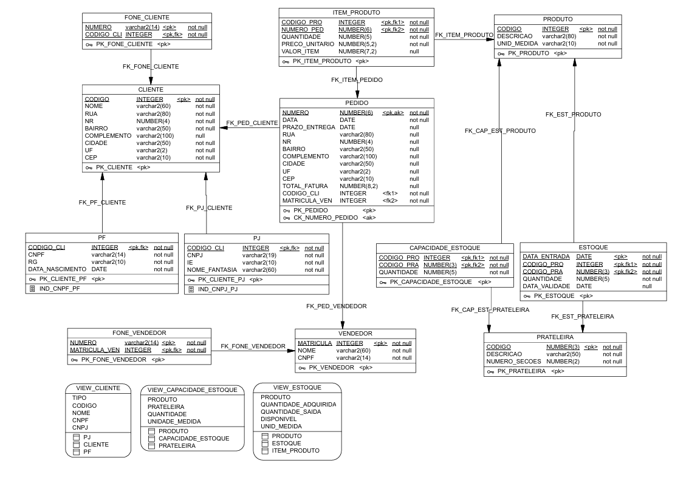

# Projeto Acadêmico Pedidos: Modelagem de Banco de Dados e PL/SQL

**Contexto:** Trabalho desenvolvido na disciplina de Banco de Dados 2.
**Tecnologias:** Oracle Database XE, PL/SQL, Oracle SQL Developer.

## Sobre o Projeto

Este repositório contém os artefatos de um projeto acadêmico focado na modelagem e implementação de um banco de dados relacional para a disciplina de Banco de Dados 2. O cenário escolhido para o estudo foi um sistema de Gestão de Pedidos e Estoque.

O objetivo principal não foi criar um produto comercial, mas sim exercitar e demonstrar a aplicação prática de conceitos fundamentais de banco de dados, tais quais:

* Linguagem de Definição e Manipulação de Dados (DDL/DML).
* Programação em Banco de Dados (PL/SQL) para regras de negócio complexas.

## Modelo Lógico

Abaixo está a representação do Diagrama Entidade-Relacionamento (DER) do projeto.

*O arquivo original do modelo pode ser encontrado no diretório `docs/`.*

## Estrutura do Repositório

Os scripts SQL foram organizados de acordo com sua função no ciclo de vida do banco de dados:

* **docs/**: Documentação do modelo.
* **scripts/ddl/**: Scripts de criação da estrutura (Tabelas, Constraints e Sequences).
* **scripts/dml/**: Massa de dados fictícia presente em uma tabela demo para testes e validação das regras.
* **scripts/triggers views functions/**: Implementação de gatilhos para automação e consistência, criação de visões para facilitar de consultas complexas e uma função auxiliar desenvolvida em PL/SQL.

## Competências Desenvolvidas

Durante o desenvolvimento deste projeto, foram aplicados os seguintes conceitos técnicos:

### 1. Integridade de Dados via PL/SQL (Triggers)
Implementação de Triggers (gatilhos) do tipo `BEFORE INSERT` para garantir a consistência lógica dos dados.
* **Exemplo:** Validação de saldo em estoque antes da confirmação de um item no pedido. Caso o saldo seja insuficiente, a transação é interrompida via `RAISE_APPLICATION_ERROR`, impedindo o estado inconsistente do banco.

### 2. Automação de Chaves Primárias
Uso combinado de Sequences e Triggers para automatizar a geração de IDs únicos, simulando o comportamento de campos auto-incrementais e garantindo a unicidade das chaves primárias.

### 3. Abstração de Dados (Views)
Criação de views como a `VIEW_ESTOQUE`, que encapsula a lógica de cálculo de saldo (Entradas - Saídas). Isso demonstra o entendimento de como simplificar o acesso aos dados para aplicações externas ou relatórios.

**Autor:** João V. M. Peres
